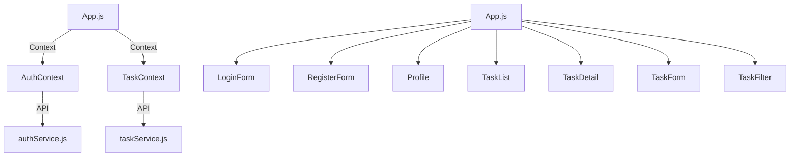

# Task Management Frontend (`task_management_frontend`)

## Project Overview

This is the frontend/UI for **TaskFlow**, a user-friendly web application for managing tasks. The frontend is a React application providing user registration, authentication, and an intuitive interface to create, view, organize, and filter tasks. All state is managed client-side, with API communication to the backend server over REST.

- **Platform:** React (Create React App)
- **Style:** Modern, minimal, responsive, light/dark toggle
- **API:** Communicates with backend via HTTP/JSON

## Features

- User authentication & registration (with JWT)
- Secure login/logout, profile views
- Task creation, editing, deletion
- Task listing, detail view, search and filters
- Filtering (by status, priority, due date), searching (title/desc), and sorting
- Responsive design: mobile, tablet, desktop
- Light/dark theme toggle
- Clean and accessible user interface

## Installation and Setup

### 1. Prerequisites

- Node.js v16+ recommended
- `npm` package manager

### 2. Install dependencies

```bash
cd task_management_frontend
npm install
```

### 3. Environment Variables

The project works out of the box with the default `package.json` scripts. If your backend API is on a different origin or port in development, set the proxy setting in `package.json` or use the environment variable below:

Create a `.env` in `task_management_frontend` (optional):

```
REACT_APP_API_BASE=http://localhost:3000/api
```

Otherwise, the frontend expects the backend at `/api` (same host/port).

### 4. Running the Application

#### Development

```bash
npm start
```

- The app will be available at [http://localhost:3000](http://localhost:3000)
- The dev server hot-reloads on code changes.

#### Production Build

```bash
npm run build
```

- Static assets are output to `build/` for deployment.

## Usage

1. Register a new account or login with an existing user.
2. Manage your tasks:
   - Create, edit, delete, or view individual tasks
   - Use the sidebar to filter or sort your task list
   - Click a task to view details; edit or delete from detail pane
   - All actions sync to the backend
3. Toggle light/dark mode with the button in the header

## API Integration

- All requests are made via `/api` endpoints (see backend README or [Swagger docs](../../task_management_backend/README.md))
- Uses JWT token (stored in localStorage) for authentication.

Endpoints:
- Auth: `/api/auth/register`, `/api/auth/login`, `/api/users/profile`, `/api/auth/logout`
- Tasks: `/api/tasks` (CRUD)

Refer to the backend's OpenAPI documentation for API & response schemas.

## Development Structure & Architecture

### Main Files

```
task_management_frontend/
├── package.json
├── src/
│   ├── App.js             # Main entry UI
│   ├── App.css            # Theme & layout
│   ├── AuthContext.js     # Auth state & logic (Context API)
│   ├── LoginForm.js       # Login UI
│   ├── RegisterForm.js    # Registration UI
│   ├── Profile.js         # Profile display & logout
│   ├── TaskContext.js     # Task state & CRUD (Context API)
│   ├── TaskList.js        # Task list UI
│   ├── TaskDetail.js      # Task detail UI
│   ├── TaskForm.js        # Task create/edit UI
│   ├── TaskFilter.js      # Filters sidebar
│   ├── authService.js     # API calls for auth
│   ├── taskService.js     # API calls for tasks
│   ├── index.js           # Entrypoint
│   └── index.css          # Base styles
└── README.md
```

### UI Layout and Design

- **Header:** Navigation, branding, theme toggle, user profile
- **Sidebar:** Filters by status, priority, dates, Plus sort & search
- **Main Area:** Task lists, modals for new/edit, and task detail pane
- **Context Providers:** Global state for auth and task data
- **CSS:** Modern, minimal, easily customizable via `App.css` (see root variables)

#### Architecture Diagram



## Environment Variables Example

```
REACT_APP_API_BASE=http://localhost:3000/api
```

- If unset, defaults to current origin + `/api`.

## Link to API Spec & Swagger Docs

- Full OpenAPI/Swagger documentation: [See Backend Docs](../../task_management_backend/README.md)  
- Interactive API reference: By default at [http://localhost:3000/docs](http://localhost:3000/docs) if backend runs locally on port 3000.

## Contact / Maintenance

- **For onboarding:** Code is modular and context-driven. Most feature logic is in `src/`, with clear separation of concerns. Start from `App.js` and explore Context/Service/Component files.
- **Handoff:** No third-party UI frameworks; only React and vanilla CSS.
- **Support:** Raise issues or questions in your project management or version control system.

---

*For API schema and backend/server setup, see the backend container's [README.md](../../task_management_backend/README.md) and [api_spec.md](../../task_management_backend/api_spec.md).*
